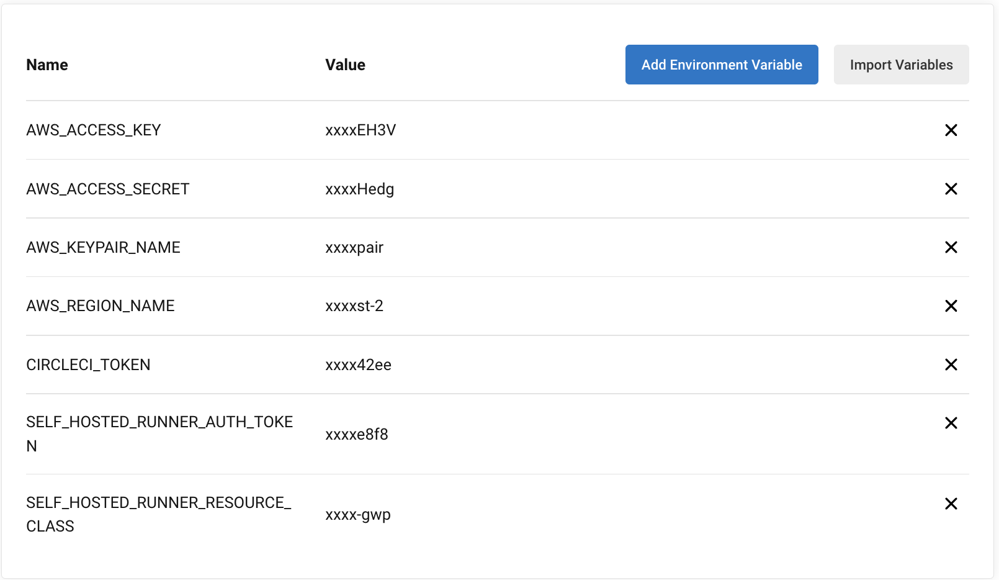

## Auto Scaling CircleCI Self Hosted Runners

Scaling CircleCI's self-hosted runners on AWS using AWS CDK. 

## CircleCI instructions

1. Set up env variables for the project. Add the following variables in your project's env settings. 



2. Trigger Job

## Local instructions

### Prerequisites

- Make sure AWS CLI is installed and configured with credentials
- [AWS CDK cli](https://docs.aws.amazon.com/cdk/v2/guide/cli.html) is installed

### Steps

1. Install CDK dependencies

```
npm install
```

2. Copy `.env.example` to `.env` and fill in the values

3. Set up env variables

```
export $(cat .env | xargs)
```

4. Deploy the stack

```
cdk synth
cdk deploy
```
